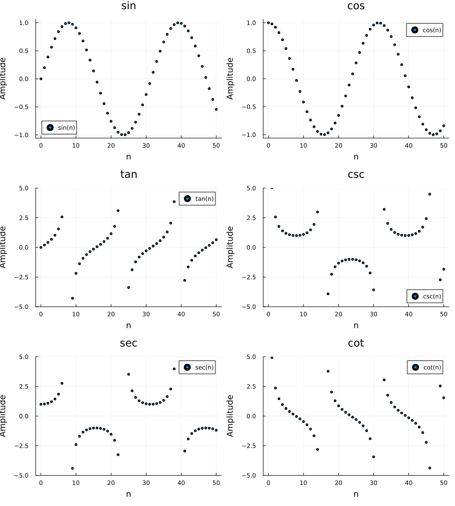

#  Discrete-Time Trigonometric Plotting Code
`File:trigo.jl `

## 1. Setup

```julia
using Plots
```

This loads the `Plots.jl` package, which provides plotting functions like `plot`, `plot!`, `savefig`, etc.

## 2. Discrete Time Vector

```julia
n = 0:50
t = n .* 0.2
```

- `n = 0:50` creates 51 integer sample indices - this represents **discrete time steps** (like `n` in discrete-time signal processing, e.g., `x[n]`).
- `t = n .* 0.2` scales these integers into radian values (0, 0.2, 0.4, ..., 10.0) so the trig functions complete a few oscillation cycles instead of just seeing the first quarter-period.
- The `.*` is **broadcasting** - it applies multiplication element-wise across the range.

## 3. Computing the Six Trigonometric Functions

```julia
y_sin = sin.(t)
y_cos = cos.(t)
y_tan = tan.(t)

y_csc = 1 ./ sin.(t)
y_sec = 1 ./ cos.(t)
y_cot = 1 ./ tan.(t)
```

- The `.` after each function name (`sin.`, `cos.`, etc.) **broadcasts** the function over every element of `t`, producing a vector of outputs.
- `csc`, `sec`, and `cot` aren't directly built-in for this purpose, so they're computed as **reciprocals**: `csc = 1/sin`, `sec = 1/cos`, `cot = 1/tan`.
- `./` is element-wise division.

## 4. Creating Six Individual Subplots

```julia
p1 = plot(n, y_sin, seriestype=:scatter, label="sin(n)", markersize=2,
 title="sin", xlabel="n", ylabel="Amplitude")
```

Each `p1` through `p6` is a **separate plot object** for one function:

| Variable | Function | Notes |
|----------|----------|-------|
| `p1` | sin | Bounded, no clipping needed |
| `p2` | cos | Bounded, no clipping needed |
| `p3` | tan | Has asymptotes → `ylim=(-5,5)` |
| `p4` | csc | Has asymptotes → `ylim=(-5,5)` |
| `p5` | sec | Has asymptotes → `ylim=(-5,5)` |
| `p6` | cot | Has asymptotes → `ylim=(-5,5)` |

Key arguments:
- `seriestype=:scatter` - plots discrete points instead of a continuous line, appropriate for **discrete-time signals**.
- `markersize=2` - controls dot size.
- `ylim=(-5,5)` - clips the y-axis so plots with asymptotes (where the function shoots to ±∞) stay readable instead of squashing the visible detail.

## 5. Combining into a Grid Layout

```julia
plot(p1, p2, p3, p4, p5, p6, layout=(3,2), size=(900,1000))
```

- `layout=(3,2)` arranges the 6 subplots into a grid: **3 rows × 2 columns**.
- Plots fill the grid **row by row**: `p1, p2` in row 1, `p3, p4` in row 2, `p5, p6` in row 3.
- `size=(900,1000)` sets the overall figure size in pixels (width, height) so each subplot has enough room to be legible.

## 6. Saving the Figure

```julia
savefig("trig_discrete_all.png")
```

- Saves the most recently created plot (the combined 6-panel figure) to a PNG file in the current working directory.


## Output 
