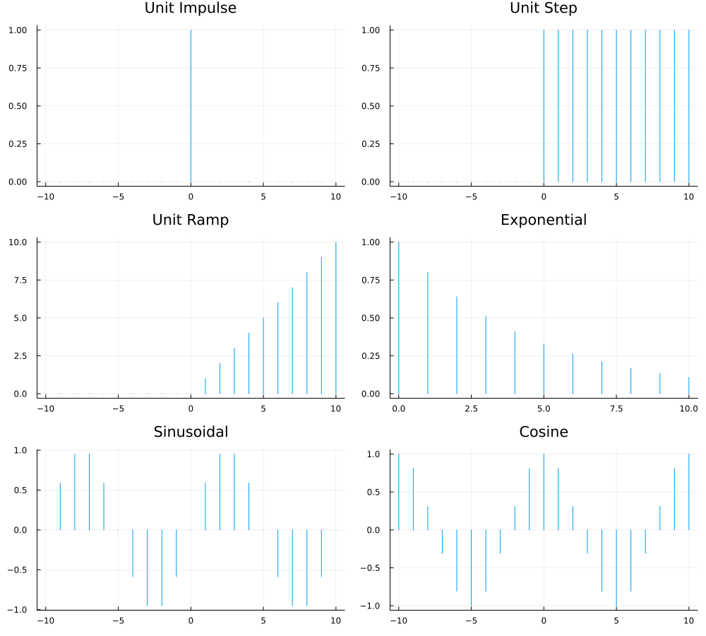

# Discrete-Time Signals in Julia (`dts.jl`)

This script generates six classic discrete-time signals, plots them, and then
classifies each one by **symmetry**, **periodicity**, and **energy/power** type.
Below is a line-by-line walkthrough of what the code does.

## Line-by-Line Explanation

```julia
using Plots
```
Loads the `Plots.jl` package, which is used to draw and save the signal plots.

```julia
n = -10:10
```
Defines the main time index `n`, ranging symmetrically from `-10` to `10`. Most
signals below are evaluated over this range.

### Signal Generation

```julia
impulse = [i == 0 ? 1 : 0 for i in n]
```
Builds the **unit impulse** `δ[n]`: equal to `1` only when `i == 0`, and `0`
everywhere else.

```julia
step = [i >= 0 ? 1 : 0 for i in n]
```
Builds the **unit step** `u[n]`: equal to `1` for `i ≥ 0`, and `0` for negative `i`.

```julia
ramp = [i >= 0 ? i : 0 for i in n]
```
Builds the **unit ramp** `r[n]`: equal to `i` for `i ≥ 0`, and `0` for negative `i`
(so it rises linearly starting at the origin).

```julia
n_exp = 0:10
exponential = [0.8^i for i in n_exp]
```
Defines a separate index range `n_exp` starting at `0` (since the exponential is
only evaluated for `n ≥ 0`), then computes `0.8^n` - a **decaying exponential**.

```julia
sinusoid = [sin(0.2π * i) for i in n]
cosine = [cos(0.2π * i) for i in n]
```
Computes a **sine** and **cosine** wave, each with angular frequency `0.2π`,
evaluated over the full symmetric range `n`.

### Plotting

```julia
p1 = sticks(n, impulse, title="Unit Impulse", legend=false)
p2 = sticks(n, step, title="Unit Step", legend=false)
p3 = sticks(n, ramp, title="Unit Ramp", legend=false)
p4 = sticks(n_exp, exponential, title="Exponential", legend=false)
p5 = sticks(n, sinusoid, title="Sinusoidal", legend=false)
p6 = sticks(n, cosine, title="Cosine", legend=false)
```
Creates a **stem plot** (`sticks`, the standard way to visualize discrete-time
signals) for each signal, with the legend hidden and a descriptive title.

```julia
plt = plot(p1, p2, p3, p4, p5, p6, layout=(3,2), size=(1000,900))
savefig(plt, "signals.png")
println("Plot saved to: ", joinpath(pwd(), "signals.png"))
```
Arranges all six subplots into a **3×2 grid**, sets the overall figure size,
saves it as `signals.png`, and prints the full path where the image was saved.

### Classification Helper Functions

```julia
function symmetry(x, n; tol=1e-9)
 if n[1] != -n[end]
 return "N/A (range not symmetric about 0)"
 end
 xr = reverse(x) # x[-n] when n is symmetric
 if all(abs.(x .- xr) .< tol)
 return "Even"
 elseif all(abs.(x .+ xr) .< tol)
 return "Odd"
 else
 return "Neither"
 end
end
```
Checks whether a signal is **even**, **odd**, or **neither**:
- First confirms the index range `n` is symmetric about `0` (required for the test
 to make sense); if not, returns `"N/A"`.
- Reverses the signal values (`xr`), which represents `x[-n]`.
- If `x[n] ≈ x[-n]` for all samples (within tolerance `tol`), the signal is **even**.
- If `x[n] ≈ -x[-n]` for all samples, the signal is **odd**.
- Otherwise, it's **neither**.

```julia
function periodicity(x, n; tol=1e-9)
 L = length(x)
 for N in 1:(L-1)
 matches = true
 for i in 1:(L-N)
 if abs(x[i] - x[i+N]) > tol
 matches = false
 break
 end
 end
 if matches
 return "Periodic (period ≈ $N samples, within window)"
 end
 end
 return "Non-periodic (within window)"
end
```
Numerically searches for periodicity **within the given sample window**:
- Tries every candidate period `N` from `1` up to `L-1` (where `L` is the number
 of samples).
- For each candidate `N`, checks whether `x[i] == x[i+N]` for every valid pair of
 indices.
- Returns the **smallest matching period** found, or `"Non-periodic"` if no
 candidate period matches across the whole window.
- Note: since this only tests within a finite window, it's an approximation -
 true periodicity requires the pattern to repeat over all `n`.

### Printing the Classification Table

```julia
println("\n===================== SIGNAL CLASSIFICATION =====================")
```
Prints a header banner for the classification report.

```julia
println("\n1) Unit Impulse δ[n]")
println(" Symmetry : ", symmetry(impulse, n))
println(" Periodicity: ", periodicity(impulse, n))
println(" Energy/Power: Energy signal (finite energy = 1, avg power → 0)")
```
Prints the classification for the **unit impulse**: its computed symmetry,
computed periodicity, and a hardcoded note that it's an energy signal (finite
total energy, zero average power).

```julia
println("\n2) Unit Step u[n]")
println(" Symmetry : ", symmetry(step, n))
println(" Periodicity: ", periodicity(step, n))
println(" Energy/Power: Power signal (infinite energy, avg power = 0.5)")
```
Same pattern for the **unit step**: computed symmetry/periodicity, plus a
hardcoded note that it's a power signal.

```julia
println("\n3) Unit Ramp r[n]")
println(" Symmetry : ", symmetry(ramp, n))
println(" Periodicity: ", periodicity(ramp, n))
println(" Energy/Power: Neither (energy AND power both infinite, grows unbounded)")
```
Same pattern for the **unit ramp**: it grows without bound, so it's classified
as neither an energy nor a power signal.

```julia
println("\n4) Exponential (0.8)^n, n ≥ 0")
println(" Symmetry : N/A (only defined for n ≥ 0, not a symmetric range)")
println(" Periodicity: ", periodicity(exponential, n_exp))
println(" Energy/Power: Energy signal (|0.8|<1 → sum of squares converges)")
```
For the **decaying exponential**, symmetry is hardcoded as `"N/A"` (since it's
only defined for `n ≥ 0`), periodicity is computed over `n_exp`, and it's noted
as an energy signal because the base `0.8` has magnitude less than 1.

```julia
println("\n5) Sinusoidal sin(0.2πn)")
println(" Symmetry : ", symmetry(sinusoid, n))
println(" Periodicity: ", periodicity(sinusoid, n))
println(" Energy/Power: Power signal (finite avg power = 0.5, infinite energy)")
```
For the **sine wave**: computed symmetry/periodicity, plus a note that it's a
power signal (typical for periodic sinusoids).

```julia
println("\n6) Cosine cos(0.2πn)")
println(" Symmetry : ", symmetry(cosine, n))
println(" Periodicity: ", periodicity(cosine, n))
println(" Energy/Power: Power signal (finite avg power = 0.5, infinite energy)")
```
For the **cosine wave**: same pattern as the sine wave.

```julia
println("\n===================================================================")
```
Prints a closing banner to mark the end of the report.

## Output

