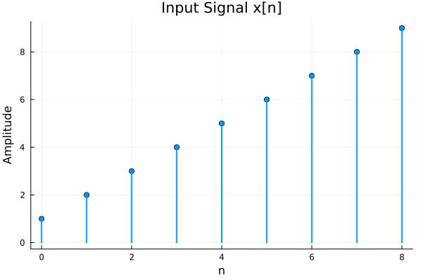
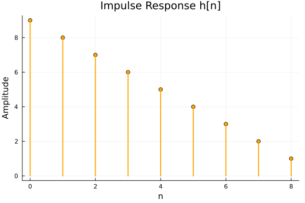
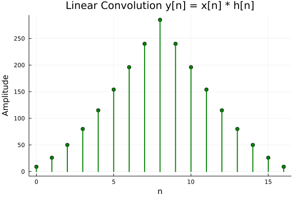
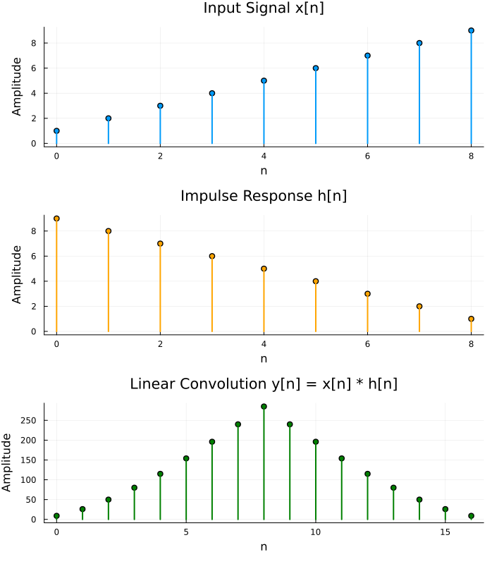

# Linear Convolution in Julia - Explained

This document walks through `linear_convolution.jl`, a script that computes
the linear convolution of two discrete signals, verifies the result against
Julia's `DSP.conv()`, and saves plots of each signal as PNG files.

## 1. Setup

```julia
using Plots
using DSP
gr()
```

- `Plots` gives plotting/`savefig` functions; `DSP` gives the reference
 `conv()` used to double-check the manual math.
- `gr()` selects the GR backend - fast, and produces clean PNGs.

## 2. The Convolution Function

This is the actual math. Linear convolution is defined as:

$$y[n] = \sum_k x[k]\,h[n-k]$$

```julia
function linear_convolution(x, h)
 Nx = length(x); Nh = length(h)
 Ny = Nx + Nh - 1 # output length
 y = zeros(Float64, Ny)

 for n in 1:Ny
 s = 0.0
 for k in 1:Nx
 m = n - k + 1
 if 1 <= m <= Nh
 s += x[k] * h[m]
 end
 end
 y[n] = s
 end
 return y
end
```

- **Output length**: two signals of length `Nx` and `Nh` convolve to length
 `Nx + Nh - 1` (e.g., 3 + 3 - 1 = 5 samples).
- **Double loop**: for each output sample `n`, it sums `x[k] * h[m]` over
 every `k` where the corresponding `h` index `m = n - k + 1` is valid.
 This mirrors "flip `h`, slide it across `x`, multiply and sum" - the
 classic textbook definition of convolution - done directly with index
 arithmetic rather than actually reversing the array.
- **1-based indexing**: Julia arrays start at 1, so `m = n - k + 1` (not
 `n - k`) keeps everything aligned correctly.

## 3. Getting Input

```julia
function read_signal(prompt)
 print(prompt)
 line = readline()
 tokens = split(line, r"[,\s]+"; keepempty = false)
 return parse.(Float64, tokens)
end
```

- `readline()` grabs the raw text typed in (e.g. `"99 98 65.4"`).
- The regex `r"[,\s]+"` splits on **one or more** commas/whitespace in a
 row, so both `"1,2,3"` and `"1 2 3"` parse correctly; `keepempty =
 false` drops stray empty strings from leading/trailing separators.
- `parse.(Float64, tokens)` - the `.` broadcasts `parse` over every token,
 converting each string to a `Float64`, producing the `x` and `h`
 vectors.

## 4. Running and Verifying

```julia
y_manual = linear_convolution(x, h)
y_builtin = DSP.conv(x, h)
println("Match: ", isapprox(y_manual, y_builtin))
```

- Runs the custom implementation and DSP.jl's built-in one on the same
 input.
- `isapprox` (not `==`) is used because floating-point summation order
 differs between the two implementations, so tiny rounding differences
 (e.g. `...0000000013` vs `...0000000012`) are expected and don't
 indicate a bug.

## 5. Plotting

```julia
n_x = 0:length(x)-1
plt_x = sticks(n_x, x, ...)
savefig(plt_x, "signal_x.png")
```

- `n_x` / `n_h` / `n_y` build the sample-index axes (starting at 0, as is
 conventional for discrete signals), even though Julia arrays are
 internally 1-indexed.
- `sticks(...)` draws a stem/lollipop plot - the standard way to
 visualize discrete-time signals (vertical lines + marker at each
 sample), rather than a continuous curve.
- `savefig(plot_object, "filename.png")` writes each plot to disk as a
 PNG.
- The final `plot(plt_x, plt_h, plt_y, layout=(3,1))` stacks all three
 plots into one combined figure for a side-by-side comparison view.

# Output 







```PS D:\Julia\03_Linear_Convolution> julia .\convolution.jl
Enter values separated by spaces or commas, e.g.: 1 2 3 4
Enter input signal x[n]: 1 2 3 4 5 6 7 8 9
Enter impulse response h[n]: 9 8 7 6 5 4 3 2 1 
x[n] = [1.0, 2.0, 3.0, 4.0, 5.0, 6.0, 7.0, 8.0, 9.0]
h[n] = [9.0, 8.0, 7.0, 6.0, 5.0, 4.0, 3.0, 2.0, 1.0]

Manual convolution result y[n] = [9.0, 26.0, 50.0, 80.0, 115.0, 154.0, 196.0, 240.0, 285.0, 240.0, 196.0, 154.0, 115.0, 80.0, 50.0, 26.0, 9.0]
DSP.conv() result y[n] = [9.0, 25.99999999999997, 50.0, 80.00000000000001, 115.0, 154.0, 196.0, 240.0, 285.0, 240.0, 196.0, 154.0, 115.0, 80.0, 50.00000000000002, 26.0, 9.000000000000012]
Match: true

Saved plots:
 signal_x.png
 signal_h.png
 convolution_result.png
 convolution_combined.png
PS D:\Julia\03_Linear_Convolution> 

```