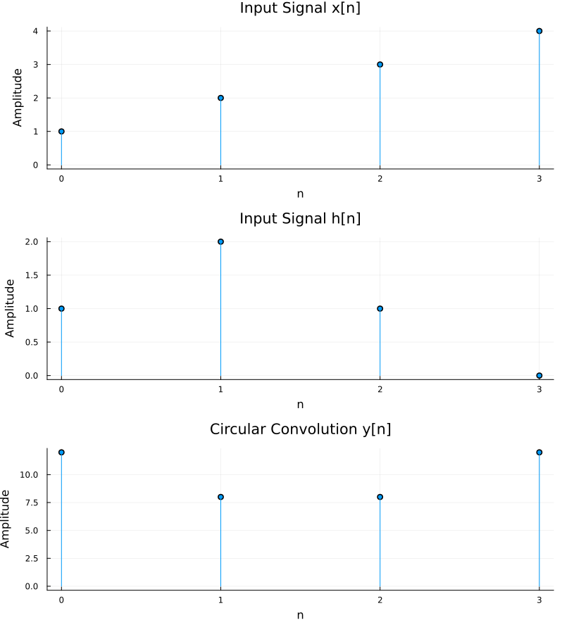

# Circular Convolution in Julia - Line-by-Line Explanation

>File : main.jl


## Setup

```julia
using Plots
```
Loads the `Plots.jl` package, which gives access to plotting functions like `plot`, `stem` styling, etc.

```julia
x = [1, 2, 3, 4]
h = [1, 2, 1, 0]
```
Defines the two discrete signals to be circularly convolved: `x[n]` and `h[n]`, each of length 4.

```julia
if length(x) != length(h)
 error("Both signals must have the same length.")
end
```
Circular convolution (as implemented here) requires both sequences to be the same length `N`. This guards against mismatched lengths and throws an error if they differ.

```julia
N = length(x)
```
Stores the common length (4 here) for use in the loops below.

```julia
y = zeros(N)
```
Initializes the output array `y[n]` with N zeros (floats, since `zeros` defaults to `Float64`), which will be filled in by the convolution sum.

## The Convolution Itself

```julia
for n in 1:N
 for k in 1:N
 index = mod(n - k, N) + 1
 y[n] += x[k] * h[index]
 end
end
```

This computes the circular convolution formula:

$$y[n] = \sum_{k=0}^{N-1} x[k]\, h[(n-k) \bmod N]$$

- Julia arrays are 1-indexed, but the convolution math is naturally 0-indexed, so there's an index adjustment.
- `n` and `k` loop from 1 to N (representing 0-indexed positions 0 to N−1 conceptually).
- `mod(n - k, N)` computes `(n-k) mod N` correctly even for negative results (Julia's `mod` always returns a non-negative result for positive modulus, unlike `%`).
- The `+ 1` converts that 0-indexed result back to a 1-indexed array position for `h`.
- `y[n] += x[k] * h[index]` accumulates the product for each `k`, building up the sum.

After both loops finish, `y` holds the full circular convolution result.

## Plotting

```julia
n = 0:N-1
```
Creates a range 0, 1, 2, 3 representing the actual sample indices (for axis labeling) - note this **reuses the variable name `n`**, overwriting the loop variable's earlier role now that the loops are done.

```julia
p1 = plot(
 n, x,
 seriestype = :stem,
 marker = :circle,
 title = "Input Signal x[n]",
 xlabel = "n",
 ylabel = "Amplitude",
 legend = false
)
```
Creates a stem plot (discrete lollipop-style plot, standard for DSP signals) of `x[n]` vs sample index `n`, with circular markers at each stem tip, a title, axis labels, and no legend.

```julia
p2 = plot(...) # same structure for h[n]
p3 = plot(...) # same structure for y[n]
```
Same stem-plot pattern repeated for `h[n]` and the convolution output `y[n]`.

```julia
final_plot = plot(
 p1, p2, p3,
 layout = (3, 1),
 size = (800, 900)
)
```
Combines all three subplots into a single figure, stacked vertically (3 rows, 1 column), with the overall canvas sized 800×900 pixels.

```julia
savefig(final_plot, "circular_convolution_results.png")
```
Exports the combined figure to a PNG file in the working directory.

## Output

```julia
println("Input x[n] = ", x)
println("Input h[n] = ", h)
println("Output y[n] = ", y)
println("\nPlot saved as: circular_convolution_results.png")
```
Prints the input and output arrays to the console, plus a confirmation message.

---

## Sanity Check

For `x = [1,2,3,4]` and `h = [1,2,1,0]`, circular convolution gives `y = [8, 8, 9, 11]` (with the mod-index logic correctly wrapping around at N=4).

**Style note:** `y = zeros(N)` gives a `Float64` array even though the inputs are integers - harmless here, but if you ever want strictly integer output, you could use `zeros(Int, N)` instead.


# Output 

