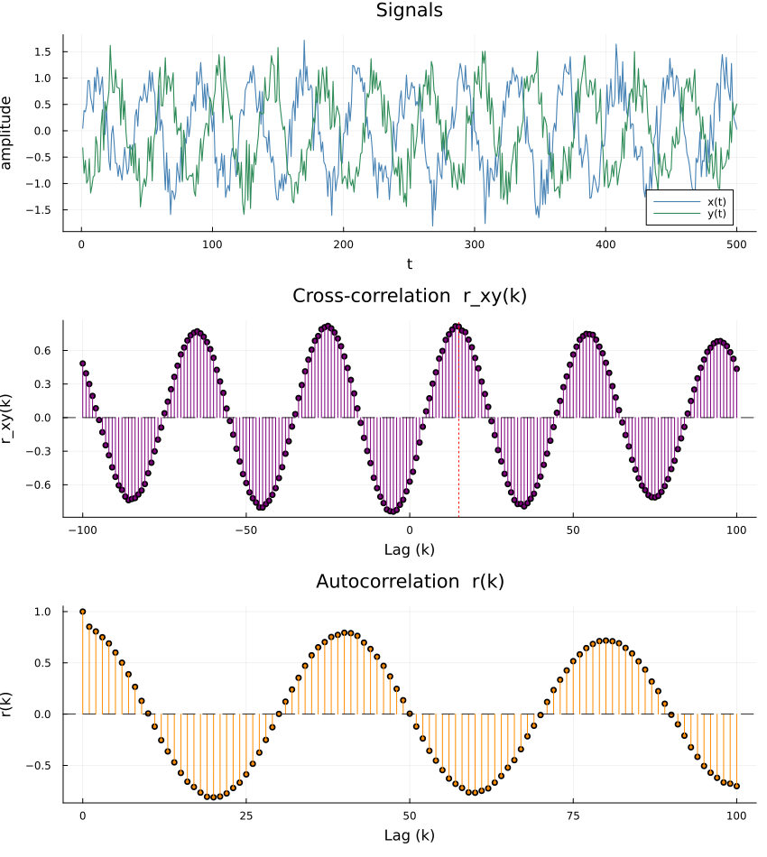

# Line-by-Line Explanation: Cross-Correlation & Autocorrelation in Julia

This script generates two related signals, computes their **cross-correlation** and
**autocorrelation**, and plots everything. Below is a walkthrough of every part.

---

## 1. Imports

```julia
using Plots
using Statistics
using Random
```

- `Plots` - plotting/visualization library (used for `plot`, `hline!`, `vline!`, `savefig`).
- `Statistics` - brings in `mean` (used to center the signals before correlating).
- `Random` - brings in `Random.seed!` for reproducible random noise.

---

## 2. `crosscorrelation` function

```julia
function crosscorrelation(x::AbstractVector{<:Real}, y::AbstractVector{<:Real}, maxlag::Int)
```
Defines a function taking two real-valued vectors `x`, `y` and an integer `maxlag`, the largest lag (positive or negative) to compute.

```julia
 @assert length(x) == length(y) "x and y must be the same length"
 N = length(x)
 @assert 0 <= maxlag < N "maxlag must be smaller than length(x)"
```
- Sanity checks: `x` and `y` must have equal length `N`.
- `maxlag` must be non-negative and strictly less than `N` (otherwise some lags would have no overlapping data points).

```julia
 xc = x .- mean(x)
 yc = y .- mean(y)
```
- Mean-centers both signals (subtracts the average from every element, broadcast with `.-`). This is required for a proper (Pearson-style) correlation - otherwise a nonzero mean would inflate the correlation values.

```julia
 denom = sqrt(sum(xc .^ 2) * sum(yc .^ 2))
```
- Computes the normalization denominator: the geometric mean of the total variance of `x` and `y`. This scales the result so it behaves like a correlation coefficient (roughly bounded between -1 and 1, though not strictly for cross-correlation at nonzero lag).

```julia
 lags = -maxlag:maxlag
 r = zeros(Float64, length(lags))
```
- `lags` is the full symmetric range of lags to evaluate, e.g. `-100:100`.
- `r` pre-allocates the output vector (all zeros initially), one entry per lag.

```julia
 for (i, k) in enumerate(lags)
```
- Loops over each lag `k`, with `i` as the corresponding 1-based index into `r`.

```julia
 num = 0.0
 if k >= 0
 @inbounds for t in 1:(N - k)
 num += xc[t] * yc[t + k]
 end
 else
 @inbounds for t in 1:(N + k)
 num += xc[t - k] * yc[t]
 end
 end
```
- For each lag `k`, computes the numerator: the sum of products of the centered signals at the appropriate offset.
 - If `k >= 0`: pairs `x[t]` with `y[t+k]` - i.e., y is shifted **backward** relative to x (checking if y at a later time resembles x now).
 - If `k < 0`: pairs `x[t-k]` with `y[t]` (equivalent to shifting x forward), covering the negative-lag case symmetrically.
- `@inbounds` skips Julia's automatic bounds-checking on array indexing for a speed boost (safe here since the loop ranges are constructed not to go out of bounds).

```julia
 r[i] = num / denom
 end
 return r
end
```
- Normalizes the numerator by `denom` and stores it in `r`. Returns the full cross-correlation vector after the loop finishes.

---

## 3. `autocorrelation` function

```julia
"""
 autocorrelation(x, maxlag)
...
"""
function autocorrelation(x::AbstractVector{<:Real}, maxlag::Int)
```
- A docstring (triple-quoted string right above the function) documents the formula, arguments, and return value - this is Julia's standard way of adding help-text that shows up via `?autocorrelation` in the REPL.
- The function computes the autocorrelation of a **single** signal `x` with itself, for non-negative lags only (since autocorrelation is symmetric: `r(-k) = r(k)`).

```julia
 N = length(x)
 @assert 0 <= maxlag < N "maxlag must be smaller than length(x)"

 xc = x .- mean(x)
 denom = sum(xc .^ 2)
```
- Same length check as before (using `N`).
- Centers `x` around its mean.
- `denom` here is just the total variance/energy of `x` (equivalent to `sum(xc.^2) * sum(xc.^2)` under a square root - i.e., this is the special case of the cross-correlation denominator when `x == y`).

```julia
 r = zeros(Float64, maxlag + 1)
 for k in 0:maxlag
 num = 0.0
 @inbounds for t in 1:(N - k)
 num += xc[t] * xc[t + k]
 end
 r[k + 1] = num / denom
 end
 return r
end
```
- Loops `k` from `0` to `maxlag` (inclusive), computing `Σ xc[t] * xc[t+k]` - the un-normalized autocovariance at lag `k`.
- Divides by `denom` to normalize (so `r[1]`, corresponding to lag 0, is always exactly `1.0`).
- Returns a vector of length `maxlag+1`, with lag 0 first.

---

## 4. Reproducibility and signal generation

```julia
Random.seed!(42)
```
- Fixes the random number generator's seed so the "random" noise is identical every time the script runs (reproducible output).

```julia
N = 500
t = 1:N
```
- `N = 500` samples; `t` is the time index, `1:500`.

```julia
x = sin.(2π .* t ./ 40) .+ 0.3 .* randn(N)
```
- Builds signal `x`: a sine wave with period 40 samples (`2π·t/40`), plus Gaussian noise scaled by `0.3` (via `randn(N)`, which draws `N` values from a standard normal distribution). The `.` before operators broadcasts them element-wise over `t`.

```julia
shift = 15
y = sin.(2π .* (t .- shift) ./ 40) .+ 0.3 .* randn(N)
```
- `shift = 15`: the amount by which `y`'s sine wave is delayed relative to `x`.
- `y` is the *same* underlying sine wave as `x`, but time-shifted by 15 samples, with its own **independent** noise draw. Because the noise is independent, the cross-correlation between `x` and `y` should show a clear peak at lag = 15 (the true shift) rather than at lag 0.

---

## 5. Computing the correlations

```julia
maxlag = 100
acf = autocorrelation(x, maxlag)
ccf = crosscorrelation(x, y, maxlag)

lags_acf = 0:maxlag
lags_ccf = -maxlag:maxlag
```
- Sets the maximum lag to examine (100 samples in either direction).
- `acf`: autocorrelation of `x` for lags 0 to 100.
- `ccf`: cross-correlation between `x` and `y` for lags -100 to 100.
- `lags_acf` / `lags_ccf`: the corresponding x-axis values for plotting.

---

## 6. Plotting

### Panel 1 - raw signals
```julia
p1 = plot(t, x, label = "x(t)", linewidth = 1.1, color = :steelblue)
plot!(p1, t, y, label = "y(t)", linewidth = 1.1, color = :seagreen,
 title = "Signals", xlabel = "t", ylabel = "amplitude")
```
- Plots `x(t)` in blue, then overlays `y(t)` in green on the same axes (`plot!` mutates/adds to an existing plot object `p1`), with title and axis labels.

### Panel 2 - cross-correlation
```julia
p2 = plot(lags_ccf, ccf,
 seriestype = :sticks,
 title = "Cross-correlation r_xy(k)",
 xlabel = "Lag (k)", ylabel = "r_xy(k)",
 legend = false, color = :purple,
 marker = (:circle, 3, :purple))
hline!(p2, [0], color = :black, linewidth = 0.8, linestyle = :dash)
vline!(p2, [shift], color = :red, linewidth = 1, linestyle = :dot, label = "true shift")
```
- Plots `ccf` vs `lags_ccf` as a **stick/stem plot** (`seriestype = :sticks`), with small circular markers at the tip of each stick, in purple.
- `hline!` draws a horizontal dashed black line at `r = 0` for reference.
- `vline!` draws a vertical dotted red line at `k = shift` (15), marking where the *true* delay is - useful to visually confirm the correlation peak lines up with the known shift.

### Panel 3 - autocorrelation
```julia
p3 = plot(lags_acf, acf,
 seriestype = :sticks,
 title = "Autocorrelation r(k)",
 xlabel = "Lag (k)", ylabel = "r(k)",
 legend = false, color = :darkorange,
 marker = (:circle, 3, :darkorange))
hline!(p3, [0], color = :black, linewidth = 0.8, linestyle = :dash)
```
- Same idea as panel 2, but for the autocorrelation of `x` alone, in orange, with only a zero reference line (no "true shift" line needed since autocorrelation is about `x` vs. itself).

### Combining panels
```julia
plt = plot(p1, p2, p3, layout = (3, 1), size = (850, 950))
```
- Stacks all three subplots (`p1`, `p2`, `p3`) vertically in a `3×1` grid layout, in a figure sized `850×950` pixels.

---

## 7. Saving output

```julia
outfile = joinpath(@__DIR__, "correlation_autocorrelation.png")
savefig(plt, outfile)
println("Saved plot to: ", outfile)
```
- `@__DIR__` is a macro giving the directory containing the current script file.
- `joinpath` builds a platform-independent file path (e.g., handles `/` vs `\` correctly) for `correlation_autocorrelation.png` in that directory.
- `savefig` writes the combined plot `plt` to that PNG file.
- `println` prints a confirmation message with the saved file's path.

---

# Output 



